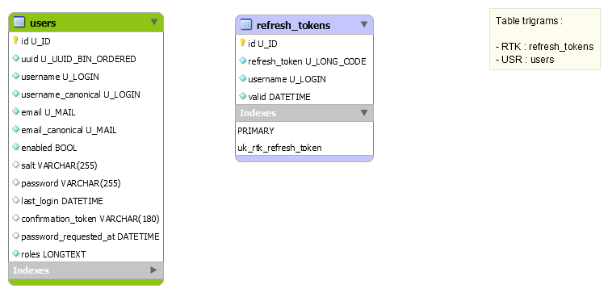

NSymfony Flex API - DB
======================

The database schema and minimal scripts to start with Symfony Flex API.

What's inside ?
---------------

  1. A workbench model
     Only 2 tables to start :
      * `users` : with minimal data to handle users.
      * `refresh_tokens` : technical table to store refresh tokens for JWT.
     
     

  1. SQL scripts to deploy your DB
      * `scripts/init/0000-init-database.sql` : (re)creates your database and your dedicated users.
      * `scripts/0001-full-database.sql` : your structures, tables, indexes, constraints.
      * `scripts/0002-ref-data.sql` : your referential data and very first users (admin).
      * `scripts/xxxx-any-name.sql` : any additional script, please increment the `xxxx` value,
        these scripts are planned for your future project iterations.

  1. Shell script to deploy your DB
  
     `scripts/bin/deploy.sh` is intended to run all your `xxxx-any-name.sql` scripts, in their defined order.
     
     The script will drop any table and recreate it with its minimal data.
      
     **NB** : this script will not play the `scripts/init/0000-init-database.sql`, you will have to play it manually :
      
         $ mysql --host=yourhost --user=youruser --password=yourpassword --default-character-set=utf8 yourdatabase < scripts/init/0000-init-database.sql
